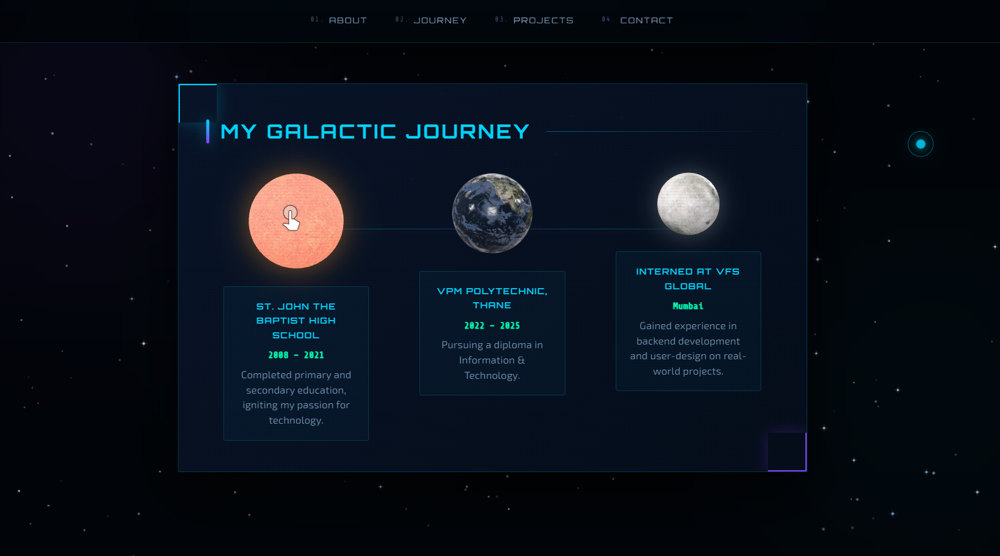

# Personal Portfolio Website

A modern **Personal Portfolio Website** built using **HTML, CSS, and JavaScript** to showcase projects, skills, and professional journey.

The website provides an **interactive and visually engaging platform** for recruiters and collaborators to explore my work.

---

## 🌐 Live Concept

This project demonstrates how a developer can create a **digital identity on the web** using client-side scripting techniques.

The portfolio includes:

- Hero introduction section  
- Space-themed journey timeline  
- Featured projects showcase  
- Interactive contact form with validation  
- Social media integration  

---

## ✨ Features

- ✔ Interactive Portfolio UI  
- ✔ 3D Models integration using `<model-viewer>`  
- ✔ JavaScript form validation using **Regular Expressions**  
- ✔ Cookie handling using **JavaScript**  
- ✔ Responsive layout  
- ✔ Animated project timeline  
- ✔ Hover button effects  
- ✔ Navigation menu with smooth section access  

---

## 🛠 Tech Stack

| Technology | Usage |
|-----------|------|
| **HTML5** | Structure of the website |
| **CSS3** | Styling and layout |
| **JavaScript** | Interactivity and validation |
| **Google Model Viewer** | 3D model rendering |
| **Google Fonts** | Typography |

---

## 📁 Project Structure

```
personal-portfolio/
│
├── index.html
├── styles.css
├── script.js
│
├── models/
│   ├── sun.glb
│   ├── earth.glb
│   └── moon.glb
│
├── images/
│   └── profile.jpg
│
├── screenshots/
│   ├── hero.png
│   ├── about.png
│   ├── journey.png
│   ├── projects.png
│   └── contact.png
│
└── README.md
```

### Structure Explanation

| Folder / File | Description |
|---------------|-------------|
| `index.html` | Main HTML file containing the website structure |
| `styles.css` | CSS file responsible for styling and layout |
| `script.js` | JavaScript file for interactivity, validation, and animations |
| `models/` | Contains 3D models used in the journey section |
| `images/` | Stores profile and other website images |
| `screenshots/` | Images used in the README preview section |
| `README.md` | Documentation for the project |

---

## 📸 Screenshots

### Hero Section


### About Section


### Journey Section

This section displays my **education and internship journey using animated 3D planets**.



### Projects Section


### Contact Section


---

## ⚙️ How It Works

### Navigation Menu

Users can navigate between the following sections:

- About  
- Journey  
- Projects  
- Contact  

---

### Form Validation

The contact form uses **JavaScript Regular Expressions** to validate user input.

Example validation:

```javascript
const nameRegex = /^[a-zA-Z\s]+$/;
const emailRegex = /^[a-zA-Z0-9]+@[a-z]+\.[a-z]{2,3}$/;
```

---

### Cookie Handling

The website stores the user's name using **browser cookies** when the form is submitted.

```javascript
document.cookie = "name=" + cookieValue + "; path=/";
```

---

### Button Hover Effect

JavaScript dynamically changes button color during **hover events**.

---

## 🧠 Skills Demonstrated

- Client-side scripting  
- DOM manipulation  
- Form validation  
- Regular Expression (Regex) usage  
- Cookie handling  
- UI interaction design  
- Responsive layout design  

---

## 🚀 Applications

This project can be used as:

- **Digital Resume**
- **Developer Portfolio**
- **Personal Branding Website**

---
