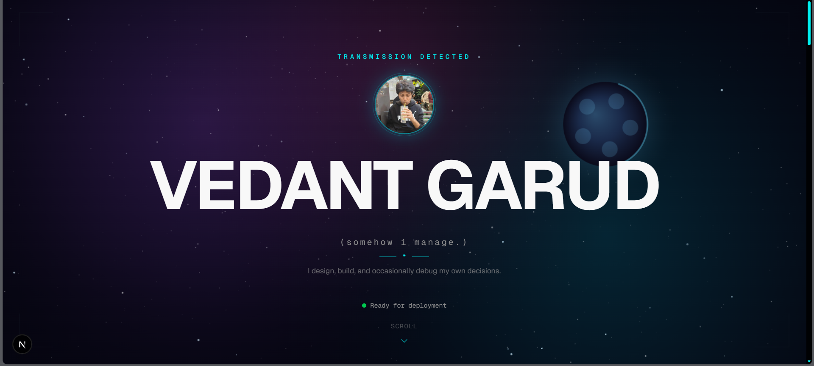
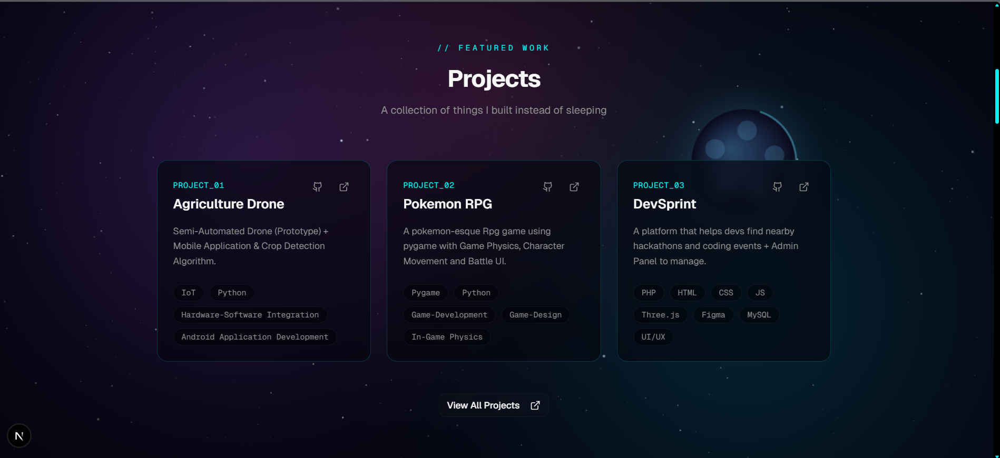
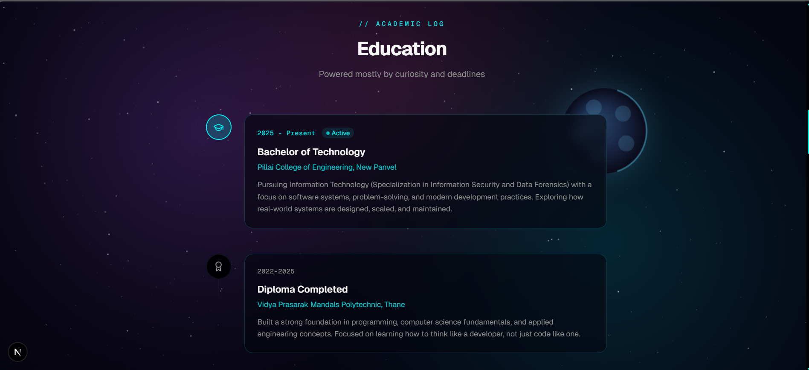
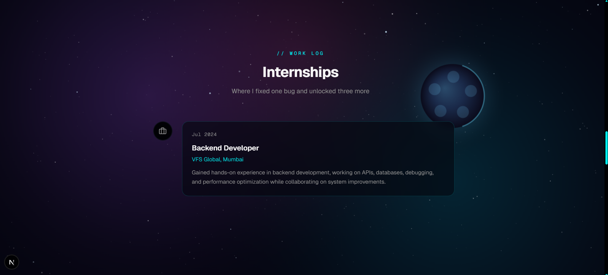
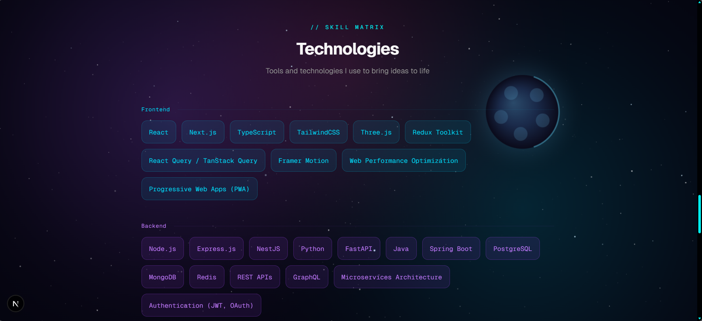
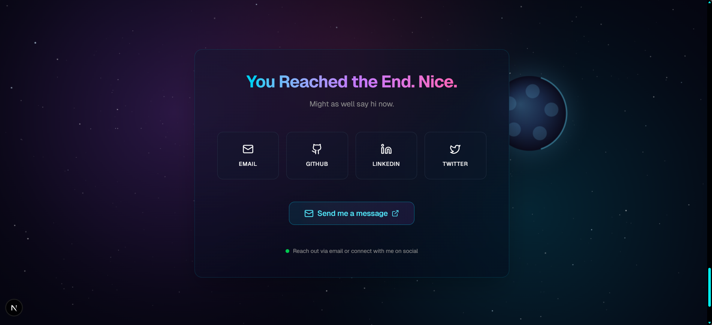

# 🚀 Personal Portfolio Website

A modern, interactive **3D developer portfolio** built using **Next.js, React, Tailwind CSS, and Three.js** to showcase projects, skills, and professional journey.

🌐 **Live Demo:** https://garudvedantportfolio.vercel.app

---

## 🌟 Overview

This portfolio serves as a **digital identity on the web**, combining clean UI, smooth animations, and immersive 3D elements to create a strong impression for recruiters and collaborators.

It demonstrates how modern web technologies can be used to build visually engaging and high-performance applications.

---

## ✨ Features

* Interactive 3D portfolio experience
* Space-themed animated journey timeline
* Featured projects showcase
* Smooth animations using Framer Motion
* Fully responsive design
* Dark / Light mode support
* Contact form with validation
* Smooth navigation across sections

---

## 🧰 Tech Stack

| Category            | Technology                           | Purpose                          |
|---------------------|-------------------------------------|----------------------------------|
| Framework           | Next.js 16                          | React framework & routing        |
| UI Library          | React 19                            | Component-based UI development   |
| Language            | TypeScript                          | Type-safe development            |
| Styling             | Tailwind CSS 4 + Radix UI           | Styling and UI components        |
| Animations          | Framer Motion                       | Smooth UI animations             |
| 3D Rendering        | Three.js + React Three Fiber + Drei | 3D models and rendering          |
| Forms & Validation  | React Hook Form + Zod               | Form handling and validation     |

---

## 🏗 Project Structure

```bash
my-portfolio/
│
├── app/                  # Pages & layouts (App Router)
├── components/           # Reusable UI and 3D components
├── hooks/                # Custom React hooks
├── lib/                  # Utilities & configs
├── public/               # Static assets (models, images)
├── styles/               # Global styles
├── screenshots/          # README images
└── package.json
```

---

## ⚙️ Getting Started

Clone the repository:

```bash
git clone <repository-url>
cd <repository-directory>
```

Install dependencies:

```bash
pnpm install
# or
npm install
# or
yarn install
```

Run the development server:

```bash
pnpm dev
# or
npm run dev
```

Open in browser:

```
http://localhost:3000
```

---

## 🌍 Deployment

This project is deployed on **Vercel**. To deploy your own version:

```bash
pnpm build
pnpm start
```

Or connect your GitHub repository directly to Vercel for automatic deployments.

---

## 🎨 Customization

You can easily personalize the portfolio:

* Update content inside `/app`
* Replace assets in `/public`
* Modify styles via Tailwind config
* Update screenshots in `/screenshots`
* Add your own projects and data

---

## 📸 Screenshots

### 🏠 Hero Section

<table>
<tr>
<td>

</td>
</tr>
</table>

### 📂 Projects Section

<table>
<tr>
<td>

</td>
</tr>
</table>

### 🎓 Education Section

<table>
<tr>
<td>

</td>
</tr>
</table>

### 💼 Internship Section

<table>
<tr>
<td>

</td>
</tr>
</table>

### 🧠 Skills Section

<table>
<tr>
<td>

</td>
</tr>
</table>

### 📬 Contact Section

<table>
<tr>
<td>

</td>
</tr>
</table>


---

## 🧠 Skills Demonstrated

* Modern web development with Next.js & React
* 3D graphics rendering in the browser
* Advanced UI animations
* Type-safe development with TypeScript
* Form validation with Zod
* Responsive design systems

---

## 📈 Future Improvements

* Blog integration (MDX)
* Analytics integration
* Multi-language support
* Testing setup (unit & integration)
* Admin panel for content updates

---
