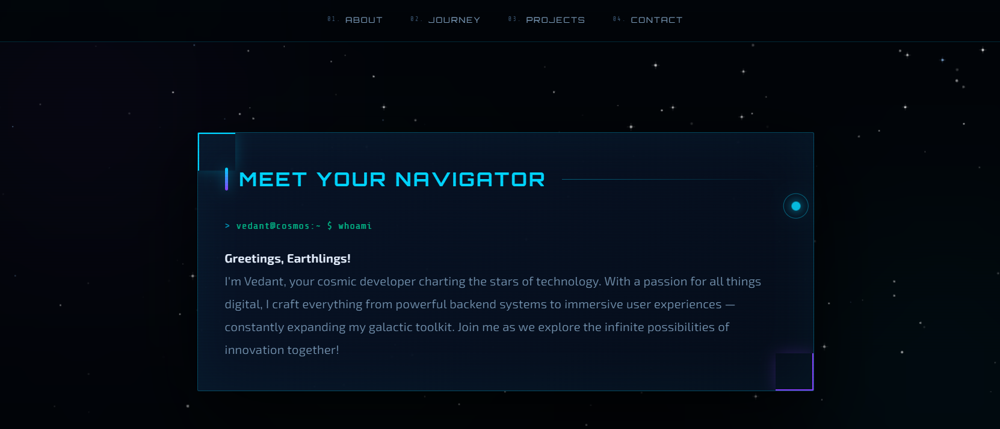

# Personal Portfolio Website

A modern **Personal Portfolio Website** built using **Next.js, React, Tailwind CSS, and Three.js** to showcase projects, skills, and professional journey.

The website provides an **interactive and visually engaging 3D platform** for recruiters and collaborators to explore my work.

---

## 🌐 Live Concept

This project demonstrates how a developer can create a **digital identity on the web** using modern web development frameworks and 3D rendering techniques.

The portfolio includes:

- Hero introduction section with immersive UI
- Space-themed journey timeline using 3D rendering
- Featured projects showcase
- Interactive contact form with validation
- Dark/Light mode support

---

## ✨ Features

- Interactive 3D Portfolio UI  
- 3D Models integration using **React Three Fiber & Drei**
- Smooth animations and transitions using **Framer Motion**
- Responsive and modern styling using **Tailwind CSS & Radix UI**
- Static typing and error catching using **TypeScript**
- Optimized routing and server components using **Next.js 16**
- Animated project timeline
- Navigation menu with smooth section access

---

## 🛠 Tech Stack

| Technology | Usage |
|-----------|------|
| **Next.js 16** | React Framework and Routing |
| **React 19** | UI Component Library |
| **TypeScript** | Type-safe development |
| **Tailwind CSS 4** | Styling and layout |
| **Framer Motion** | Complex UI animations |
| **Three.js & R3F** | 3D rendering and models |
| **Zod & React Hook Form** | Form validation |

---

## 📁 Project Structure

```text
my-portfolio/
│
├── app/                  # Next.js App Router pages and layouts
├── components/           # Reusable React components (UI, layout, 3D)
├── hooks/                # Custom React hooks
├── lib/                  # Utility functions and configurations
├── public/               # Static assets (3D models, images, etc.)
├── styles/               # Global CSS styles
├── screenshots/          # Images used in the README preview
└── package.json          # Project dependencies and scripts
```

---

## 🚀 How to Run

To run this project locally on your machine, follow these steps:

1. **Clone the repository:**
   ```bash
   git clone <repository-url>
   cd <repository-directory>
   ```

2. **Install dependencies:**
   This project uses `pnpm`, but you can also use `npm` or `yarn`.
   ```bash
   pnpm install
   # or
   npm install
   ```

3. **Start the development server:**
   ```bash
   pnpm dev
   # or
   npm run dev
   ```

4. **Open your browser:**
   Navigate to [http://localhost:3000](http://localhost:3000) to view the application.

---

## 📸 Screenshots

### Hero Section


### Projects Section


### About Section


### Education Section


### Internship Section


### Skills Section


### Contact Section


---

## 🧠 Skills Demonstrated

- Modern Web Development (Next.js, React)
- 3D Graphics and Rendering in the Browser
- Complex UI Animations
- Form validation schemas (Zod)
- Responsive layout design
